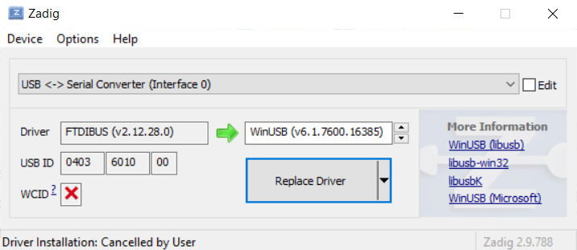

# iCE40prog
Very essential tool for iCE40 FPGAs *SRAM* bitstream programming using bare bones FTDI C232HM MPSSE cable. Does not support (yet) serial flash programming.
Tested on Ubuntu 16.04.2, Cygwin and MinGW (with Windows Zadig driver) with [UPDuino V1](https://github.com/gtjennings1/UPDuino_v1_0) and [GoBoard](https://www.nandland.com) FPGA boards.

## Upduino board
Connect FTDI cable wires as follows:

|Signal   | FTDI cable color | UPDuino  |
|---------|:----------------:|:--------:|
| CLK     |  Orange          |  JP2-3   |
| MOSI    |  Yellow          |  JP2-1   |
| CS      |  White           |  JP2-5   |
| RESET   |  Blue            |  JP1-2   |
| Vdd     |  Red             |  JP2-2   |
| GND     |  Black           |  JP2-6   |

Leave J1 unpopulated. A blinky LED bitstream example is provided for testing purposes in the 'test-designs' directory

## Go Board
Go Board can only work with the bitbanged version of the tool as MISO and MOSI signals
are configured for iCE40 master mode (i.e.: loads bitstream from external serial flash).

## Build and installation

### Linux 
Install libftdi:  `apt install libftdi1-dev`. 
Copy (as root) the contents of udev-rules directory into /etc/udev/rules.d/ if willing to use MPSSE cable as non-root user.

### Windows
Install libftdi1: on MinGW use 'Pacman' package manager. On Cygwin use its package installer.  
Use Zadig to install WinUSB driver over *first* USB/Serial converter (Interface 0) as shown here:

Note: libmpsse essential sources are embedded in the project for convenience as there's no Debian package for it yet.
TODO: Fix broken build of SPI tool version (bit banged one works fine).
